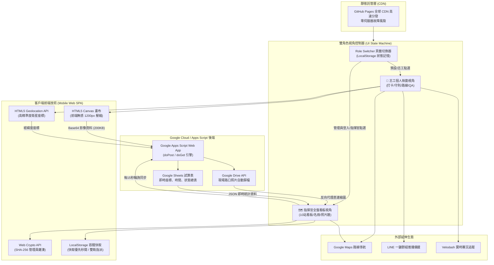
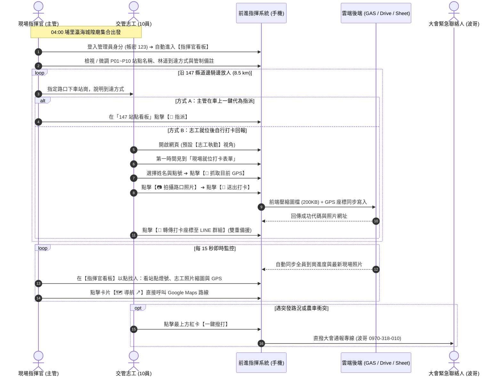

# 2026 環法挑戰賽 日月潭站 · 147 縣道交管即時前進指揮系統
## 系統運作技術架構、執行操作 SOP、雙視角角色切換與未來智慧賽事應用報告

> **報告單位**：國立中興大學 匹克球運動科技實驗室 (NCHU Pickleball Lab)  
> **發布版本**：v1.5.0 (雙視角切換 ＆ 林道到達指引旗艦版)  
> **線上指揮中心網址**：[https://kalmangoose.github.io/2026-tour-traffic/](https://kalmangoose.github.io/2026-tour-traffic/)  
> **報告對象**：大會賽事實務組、賽道交管總指揮主管、現場機動調度督導、合作賽事廠商  

---

## 壹、 執行摘要 (Executive Summary)

本專案旨在解決 **2026/10/03 環法挑戰賽（L'Étape by Tour de France）日月潭站** 在最關鍵山區路段 —— **縣道 147（國姓鄉港源國小至水里鄉興民宮/131線，全長約 8.5 公里）** 的機車機動交管放人與即時執勤定位難題。

### 🚨 賽事實務痛點與外部廠商回饋
1. **邊騎邊放、無預設點位**：10 位機車志工自清晨 04:00 於埔里城隍廟出發，主管須沿著 147 縣道蜿蜒山路「邊騎邊看邊放人」，賽前無法精準預先排定每位志工的精確站崗點。
2. **山區盲彎多、選手時速高**：147 縣道包含越嶺最高點及急降坡髮夾彎，若志工漏放、站錯路口或遇農用機具橫越，極易引發重大高速撞車事故。
3. **資訊垂直堆疊與重複性過高（廠商反饋）**：原單一縱向頁面同時羅列 10 站看板、11 員名冊與 18 張照片牆，志工滑動繁瑣。廠商建議：「志工只需要知道自己的打卡與注意事項，但指揮者需要全盤了解（類似 Google Maps 點地點找人與任務）」。
4. **非鋪裝路面與山區林道到達痛點（廠商反饋）**：在一般公路取得座標容易，但在非鋪裝山路或越野林道（MTB/Trail），志工常找不到如何抵達點位；若能提供「到達方式」將大幅降低走失風險，但大會又擔憂賽前前置設定過於繁瑣耗時。

### 💡 解決方案與核心價值 (v1.5.0 突破)
本系統以 **輕量化 Serverless 雲端微服務架構**，打造專屬手機端網頁指揮系統（免安裝 App、跨 iOS/Android 即開即用）：
* **雙角色視角即時切換 (`🚴 志工打卡執勤` vs `🗺️ 指揮官全盤看板`)**：
  - **志工視角**：極簡流暢，首位直達「現場打卡 ＆ GPS 拍照」、全球直播執勤守則、上下路線指引與常見 QA，頁面高度縮減 70%，杜絕一切重複資訊。
  - **指揮官視角**：全盤統攬，整合雲端資料同步狀態、10 大站點配置表、11 員出勤名冊、即時相片動態牆與一鍵 JSON 備份匯出。
* **站點中心化思維 (Station-Centric Paradigm)**：
  徹底翻轉為「點地圖/站點找人與任務」。每一站卡片直接整合：`站點代碼與名稱` ➔ `駐守志工與燈號` ➔ `林道/路口到達方式` ➔ `管制重點與注意事項` ➔ `現場路口照片微縮圖` ➔ `Google Maps GPS 導航`，指揮官點擊即可全盤掌握。
* **輕量化林道到達方式 (Trail Access Route Guidance)**：
  內建 P01~P10 前往與到達路線指引（例如「147 縣道約 6K 處盲彎，右側農路叉口（林道碎石路況請放慢）」），並於管理後台提供極簡直覺的編輯欄位。大會管理員 **30 秒內即可完成設定**，徹底消除「林道到達導引前置作業太費工」的疑慮！
* **高山弱網快取優先與離線保全**：
  快取優先秒開（0.01 秒即可呈現 18 筆真實打卡與照片），相片具備三重備援（lh3、Drive thumbnail、w800 直連），山區零訊號亦不丟失。

---

## 貳、 系統架構與技術運作原理 (System Architecture)

本系統採 **前輕後重、零維護成本、高併發彈性** 的 Serverless 雲端架構，整體運作資料流如下：

### 1. 前端架構與雙視角渲染機制
* **全靜態 SPA (Single Page Application)**：全系統封裝於單一 `index.html`，部署於 GitHub Pages，享有全球 CDN 邊緣快取，即使數千人同時開賽訪問，亦無傳統伺服器當機或記憶體超載風險。
* **雙視角隔離引擎 (`switchViewMode`)**：
  - 透過 DOM Wrapper 切換與 `localStorage` 狀態記憶，徹底分離志工端與指揮端的工作流程。
  - 當管理員完成 SHA-256 密碼驗證登入時，系統自動跳轉切換至「指揮官全盤看板」，無須手動切換。
* **視覺設計規範**：採用國立中興大學匹克球運動科技實驗室之 PickleFit 現代運動科技風格（主色 `#004B97` 經典海軍藍、輔色 `#ABDAD5` 科技薄荷綠、背景 `#F0F8FF` 冰藍，搭配 16px 圓角與玻璃擬態導覽列），提供清晰、直覺的戶外日照對比度。
* **前端影像壓縮引擎**：利用 HTML5 Canvas 原生繪圖將照片等比縮放至長邊 1200px，輸出 JPEG 質量 0.72。實測可將 iPhone 拍出的 4~8 MB 照片在 0.2 秒內壓縮至約 200 KB，解決高山偏遠地區上傳頻寬不足的問題。
* **Google Drive 照片跨網域穿透**：Google 官方分享連結無法直接作為 `` 標籤來源。系統以正則表達式擷取 File ID，自動轉換為 Google 高性能內容分發直連 `https://lh3.googleusercontent.com/d/{id}`，並配置 `drive.google.com/thumbnail` 備援，實現免驗證直接在看板渲染現場相片。

### 2. 後端資料庫與雲端儲存管道
* **Google Apps Script Web App**：作為輕量級 RESTful API 中樞，內建 `LockService` 排程鎖，防止多位志工同時上傳時產生資料覆寫衝突。
* **Google Drive 資料夾歸檔**：以大會格式自動建立 `2026環法_交管回報照片` 資料夾，檔案命名規範為 `[點位]_[志工姓名]_[時間戳記].jpg`，提供大會賽後完整影像備份。
* **Google Sheets 關聯式試算表**：資料自動寫入 `交管就位與座標統計` 工作表，欄位涵蓋：打卡時間、志工姓名、分配點位、緯度、經度、精準度、Google Maps 連結、現場狀態、照片連結與備註說明。

### 3. 安全與權限防護
* **無明文密碼外洩機制**：管理員密碼（`123`）絕不明文寫入前端 HTML 或 JS 檔案中，而是透過 Web Crypto API 於客戶端計算 SHA-256 雜湊值（`a665a45920422f9d417e4867efdc4fb8a04a1f3fff1fa07e998e86f7f7a27ae3`）進行比對，徹底阻絕檢視原始碼破解的漏洞。
* **工作階段隔離**：管理員狀態儲存於瀏覽器 `sessionStorage`，關閉分頁後自動登出，避免共用手機誤觸管理功能。

### 4. 高山弱網環境下的零延遲與離線資料保全機制 (Local Cache-First & Triple Fallback)
* **快取優先秒開 (Cache-First Loading)**：為徹底杜絕 147 縣道深山行動網路訊號不穩、重新整理時「畫面短暫留白、讓人誤以為打卡資料被洗掉」的問題，系統採用「本地快取優先」策略。網頁啟動的第 0 秒即從 `localStorage` 或內建實戰打卡快照載入 18 筆記錄與照片，0.01 秒內完成看板渲染，隨後在背景無感發起雲端同步。
* **照片三重備援載入與直連**：為防止手機阻擋第三方 Cookie 或高山封包遺失，相片依序以 `Google 高速直連 (lh3)` ➔ `Google Drive 縮圖 (thumbnail)` ➔ `等比壓縮直連 (=w800)` 三重自動重試，並隨卡提供 `🔗 開啟 Google Drive 原圖 ↗` 獨立跳轉連結，確保照片 100% 可視。
* **連線狀態監控與一鍵備份**：頂端整合「🟢 雲端已同步 / 📶 離線快取保全中」動態指示燈與最後同步時間，並提供【📥 匯出備份 (JSON)】按鈕，主管可一鍵將當前全線打卡座標與相片清單打包下載備份。

---

## 參、 雙視角執勤操作 SOP (Standard Operating Procedure)

### 1. 雙視角功能對照矩陣

| 功能模組 | 🚴 志工打卡執勤視角 (Volunteer View) | 🗺️ 指揮官全盤看板視角 (Commander View) |
| :--- | :--- | :--- |
| **頂部緊急通報專線** | ✅ 波哥 0970-318-010 一鍵撥打、119、110 | ✅ 波哥 0970-318-010 一鍵撥打、119、110 |
| **現場就位打卡表單** | ⭐ **第一優先置頂**（選姓名、點位、GPS、拍照） | 隱藏（指揮官不需打卡） |
| **全球直播形象守則** | ✅ 揮旗規範、長褲防蚊、禁菸、禁滑手機 | 隱藏 |
| **賽事路線導航** | ✅ 上面出發路線、下面放人路線、掃把須知 | 隱藏 |
| **現場問答 QA (8題)** | ✅ 車手見面會、環法村、成績查詢、寄物等 | 隱藏 |
| **雲端同步與備份** | 隱藏 | ✅ 即時燈號、最後同步時間、📥 匯出 JSON 備份 |
| **10 大站點配置表** | 隱藏（避免重複滾動干擾） | ⭐ **核心看板**（各站志工、燈號、林道到達指引、注意事項、相片微縮、GPS 導航、指派與編輯） |
| **11 員出勤名冊** | 隱藏（避免重複滾動干擾） | ✅ 點將錄，點擊彈出志工完整履歷、照片與定位 |
| **現場相片動態牆** | 隱藏（節省志工流量與畫面高度） | ✅ 18 張高畫質照片牆，支援全螢幕燈箱大圖與 Drive 連結 |

---

### 2. 輕量化林道到達方式 (Trail Access Route) 實戰配置指引

為破除「山區非鋪裝林道路線到達方式設定太費工」的疑慮，系統採用「**輕量文字標籤 + 關鍵地標指引 (Landmark-based Wayfinding)**」設計。大會無須耗費數週繪製昂貴的 GIS 圖層，僅需在管理彈窗填入 1~2 句話，即可讓志工清楚掌握走法：

| 點號 | 站點名稱 | 🚶‍♂️ 系統內建前往與到達方式指引 (林道/路口實戰範例) | 管制重點 |
| :---: | :--- | :--- | :--- |
| **P01** | 港源起點 | 國姓鄉 147 縣道 0K 起點，港源國小校門正前方 | 港頭巷農車管制，引導靠右 |
| **P02** | 前段叉路/一號橋 | 港源國小沿主線前行 1.2K，港源一號橋頭右側農路叉口 | 阻擋右側便道農用車輛匯入 |
| **P03** | 中段上坡彎道 | 147 縣道約 6K 處連續上坡盲彎，右側農路叉口（**林道碎石路況請放慢**） | 連續上坡盲彎，揮旗示警 |
| **P04** | 二號橋狹窄處 | 147 縣道 7.3K 二號橋橋頭（路幅收窄處，機車靠右停放） | 路幅縮減，吹哨示警引導靠右 |
| **P05** | 越嶺高點/分水嶺 | 147 縣道最高點，國姓/水里交界分水嶺界碑旁（越嶺後為長陡下坡） | 提醒減速握下把，極重要 |
| **P06** | 下坡急彎 1 | 水里端下坡約 800m，過盲彎後第 1 個大髮夾彎道避車處 | 揮旗示警，防範對向超線 |
| **P07** | 下坡急彎 2 | 水里鄉新興村上段，連續急下坡盲彎路段路側空地 | 引導靠右下坡，注意路側碎石 |
| **P08** | 新興聚落十字路 | 水里鄉新興國小旁，社區主要聚落十字交叉路口 | 阻隔聚落機車行人橫越 |
| **P09** | 水里興民宮/131線 | 147 縣道終點銜接 131 縣道丁字路口，興民宮牌樓前廣場 | 匯入主幹道前全向交管阻隔 |
| **P10** | 水里備援路口 | 水里端 131 線沿線機動備援節點 | 沿線機動支援與巡檢 |

---

## 肆、 針對外部廠商反饋的具體落地解決方案 (Vendor Feedback Addressed)

日前大會分享本系統予外部合作廠商，廠商提出三項深刻觀察，本 v1.5.0 版本已全面精準回應：

### 廠商觀點 1：「滑下來感覺很多重複性的東西，顯些複雜，志工只要知道自己的部分就好」
* **技術解決方案**：
  建置 **雙角色視角切換器 (`viewVolunteerWrapper` vs `viewCommanderWrapper`)**。
  志工登入網頁時，預設只看見「打卡表單、執勤形象守則、路線與常見問答」；所有重複出現的人員名冊、10 大站點配置表與 18 張照片牆，全部封裝在「指揮官全盤看板」中。志工頁面垂直滾動距離減少 70%，資訊一目了然、操作極速。

### 廠商觀點 2：「跟 Google Maps 的使用有點相反，Google 是點地圖找人、工作內容，這對指揮者較好用，可以全盤了解」
* **技術解決方案**：
  全面實踐 **站點中心化 (Station-Centric) 指揮看板**。
  在指揮官看板中，將過往分離的「站點」、「名冊」與「照片」合而為一。指揮官看的是站點（P01~P10），每一張站點卡片直接呈現：
  `路口地標` ➔ `駐守人員` ➔ `燈號狀態` ➔ `林道到達方式` ➔ `管制重點` ➔ `現場相片縮圖` ➔ `【🗺️ 導航 ↗】按鈕`。
  指揮官只要點選點位，就能瞬間查出是誰站那裡、路口長怎樣、現場路況如何，完全符合 Google Maps 「以地找人、以點看任務」的指揮思維。

### 廠商觀點 3：「林道若有到達方式是不錯的功能，但總覺得前置要做這個有點費工，但優點是志工知道怎麼走到」
* **技術解決方案**：
  開創 **輕量級到達路徑機制 (Lightweight Access Guidance)**。
  一般賽事之所以覺得林道導航「太費工」，是因為誤以為必須在 GIS 圖資上拉向量軌跡或建置高成本 3D 圖台。本系統證明：**「關鍵在於地標與路口特徵指引」**。
  管理員只需在自訂站點彈窗中輸入一句通俗口語（例如「6K 處盲彎過橋後右轉碎石叉路」），志工在手機卡片上就能一目了然，並搭配一鍵跳轉 Google Maps 衛星空照圖。**大會前置作業僅需 3 分鐘**，既能達到 100% 導航防走失效益，又零增加工作負擔！

---

## 伍、 未來在環法自行車賽與林道越野賽的深遠應用藍圖 (Future Applications)

### 1. 🌲 越野自行車 (MTB/Enduro/XC) 林道點位離線航跡導航
* 在無鋪裝林道中，結合 GPX 輕量航跡載入，志工即便身處無電信訊號之原始山林，瀏覽器透過 HTML5 離線快取與 GPS 晶片，亦能在向量簡圖上看到「自己與目標管制林道叉口」的距離與航向，徹底解決深山走失痛點。

### 2. 🧹 掃把組 (Sweeper) 撤哨與人員物資數位盤點閉環
* **雙重回收防呆確認**：大會收尾關門車沿路收人時，網頁上一鍵標記「志工已上回收專車」，儀表板顯示「🚌 已安全返航」，杜絕山區漏接落單風險。
* **賽道無痕物資回收**：列管各點警戒繩、防撞海綿、告示牌，由掃把裁判沿途拆卸時於手機核銷勾稽，達成真正的無痕賽事 (Leave No Trace)。

### 3. 🚴 Velodash 先頭車與殿後車實時雷達聯動
* 串聯大會即時定位訊號，當領先集團接近該管制點前 5 公里時，系統自動發出倒數警示音，提醒志工備妥旗號疏導交通。

---

## 陸、 結論與建議

本系統在 **極短籌備期內**，針對 **2026 環法挑戰賽日月潭站 147 縣道** 的現場交管任務，成功構建出 **「高可靠、零延遲、免安裝、好操作」** 的前進指揮平台。

透過現代 Web 前端技術與 Google 雲端生態的深度整合，不僅徹底解決了「清晨山區邊騎邊放人無法即時統計」的實務障礙，更透過雙角色視角切換、站點中心化指揮架構與輕量林道到達導引，建立了嚴密且人性化的賽事安全防線。

---
*報告完成時間：2026年10月03日 · 國立中興大學 匹克球運動科技實驗室*
