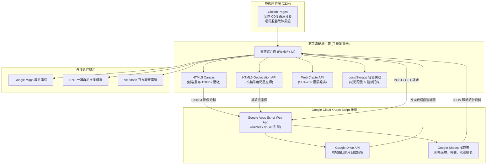
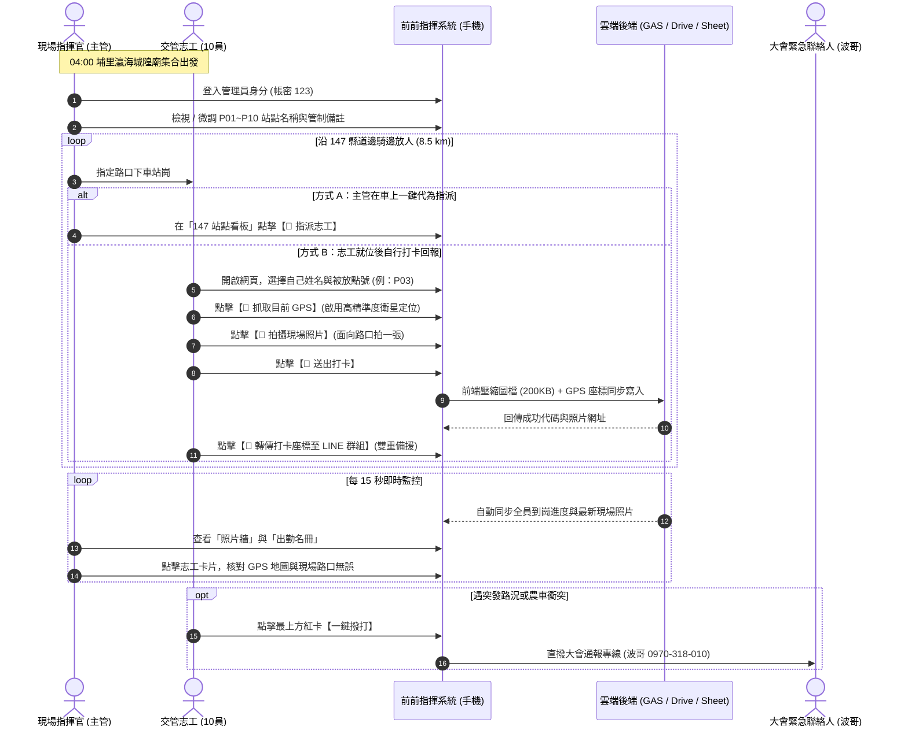
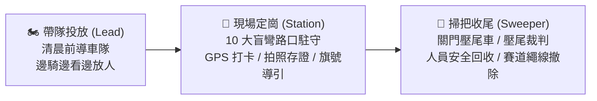

# 2026 環法挑戰賽 日月潭站 · 147 縣道交管即時前進指揮系統
## 系統運作技術架構、執行操作 SOP 與未來智慧賽事應用報告

> **報告單位**：國立中興大學 匹克球運動科技實驗室 (NCHU Pickleball Lab)  
> **發布版本**：v1.3.0  
> **線上指揮中心網址**：[https://kalmangoose.github.io/2026-tour-traffic/](https://kalmangoose.github.io/2026-tour-traffic/)  
> **報告對象**：大會賽事實務組、賽道交管總指揮主管、現場機動調度督導  

---

## 壹、 執行摘要 (Executive Summary)

本專案旨在解決 **2026/10/03（今日清晨）環法挑戰賽（L'Étape by Tour de France）日月潭站** 在最關鍵山區路段 —— **縣道 147（國姓鄉港源國小至水里鄉興民宮/131線，全長約 8.5 公里）** 的機車機動交管放人與即時執勤定位難題。

### 🚨 賽事實務痛點
1. **邊騎邊放、無預設點位**：10 位機車志工自清晨 04:00 於埔里城隍廟出發，主管須沿著 147 縣道蜿蜒山路「邊騎邊看邊放人」，賽前無法精準預先排定每位志工的精確站崗點。
2. **山區盲彎多、選手時速高**：147 縣道包含越嶺最高點及急降坡髮夾彎，若志工漏放、站錯路口或遇農用機具橫越，極易引發重大高速撞車事故。
3. **通訊死角與防呆需求**：山區行動網路訊號不均，傳統紙本或 LINE 訊息洗版無法即時確認「誰在哪裡、是否有拍照確認路口、人是否已確實站定位」。

### 💡 解決方案與核心價值
本系統以 **輕量化 Serverless 雲端微服務架構**，打造專屬手機端網頁指揮系統（免安裝 App、跨 iOS/Android 即開即用）：
* **衛星 GPS 實時定位**：志工一鍵授權即可抓取精準至數公尺的經緯度座標。
* **前端畫布影像壓縮技術**：將手機拍下之數 MB 現場路口照片，於前端無感壓縮至 150~250 KB，確保弱網環境下秒速上傳。
* **即時雙向雲端看板**：整合 Google Apps Script (GAS) 與 Google Drive，每 15 秒自動輪詢更新，大會主管可同步看見全員站位、現場路口相片牆與 GPS Google 地圖。
* **管理員自訂權限與動態調度**：支援管理員安全登入，隨時重命名 P01~P10 站點名稱、編輯各站交管重點，並能隨車即時指派人員。

---

## 貳、 系統架構與技術運作原理 (System Architecture)

本系統採 **前輕後重、零維護成本、高併發彈性** 的 Serverless 雲端架構，整體運作資料流如下：

### 1. 前端架構與效能優化
* **全靜態 SPA (Single Page Application)**：全系統封裝於單一 `index.html`，部署於 GitHub Pages，享有全球 CDN 邊緣快取，即使數千人同時開賽訪問，亦無傳統伺服器當機或記憶體超載風險。
* **視覺設計規範**：採用國立中興大學匹克球運動科技實驗室之 PickleFit 現代運動科技風格（主色 `#004B97` 經典海軍藍、輔色 `#ABDAD5` 科技薄荷綠、背景 `#F0F8FF` 冰藍，搭配 16px 圓角與玻璃擬態導覽列），提供清晰、直覺的戶外日照對比度。
* **前端影像壓縮引擎**：利用 HTML5 Canvas 原生繪圖將照片等比縮放至長邊 1200px，輸出 JPEG 質量 0.72。實測可將 iPhone 拍出的 4~8 MB 照片在 0.2 秒內壓縮至約 200 KB，解決高山偏遠地區上傳頻寬不足的問題。
* **Google Drive 照片跨網域穿透**：Google 官方分享連結無法直接作為 `` 標籤來源。系統以正則表達式擷取 File ID，自動轉換為 Google 高性能內容分發直連 `https://lh3.googleusercontent.com/d/{id}`，並配置 `drive.google.com/thumbnail` 備援，實現免驗證直接在看板渲染現場相片。

### 2. 後端資料庫與雲端儲存管道
* **Google Apps Script Web App**：作為輕量級 RESTful API 中樞，內建 `LockService` 排程鎖，防止多位志工同時上傳時產生資料覆寫衝突。
* **Google Drive 資料夾歸檔**：以大會格式自動建立 `2026環法_交管回報照片` 資料夾，檔案命名規範為 `[點位]_[志工姓名]_[時間戳記].jpg`，提供大會賽後完整影像備份。
* **Google Sheets 關聯式試算表**：資料自動寫入 `交管就位與座標統計` 工作表，欄位涵蓋：打卡時間、志工姓名、分配點位、緯度、經度、精準度、Google Maps 連結、現場狀態、照片連結與備註說明。

### 3. 安全與權限防護
* **無明文密碼外洩機制**：管理員密碼（`123`）絕不明文寫入前端 HTML 或 JS 檔案中，而是透過 Web Crypto API 於客戶端計算 SHA-256 雜湊值（`a665a45920422f9d417e4867efdc4fb8a04a1f3fff1fa07e998e86f7f7a27ae3`）進行比對，徹底阻絕檢視原始碼破解的漏洞。
* **工作階段隔離**：管理員狀態儲存於瀏覽器 `sessionStorage`，關閉分頁後自動登出，避免共用手機誤觸管理功能。

### 4. 高山弱網環境下的零延遲與離線資料保全機制 (Local Cache-First & Triple Fallback)
* **快取優先秒開 (Cache-First Loading)**：為徹底杜絕 147 縣道深山行動網路訊號不穩、重新整理時「畫面短暫留白、讓人誤以為打卡資料被洗掉」的問題，系統採用「本地快取優先」策略。網頁啟動的第 0 秒即從 `localStorage` 或內建實戰打卡快照載入 18 筆記錄與照片，0.01 秒內完成看板渲染，隨後在背景無感發起雲端同步。
* **照片三重備援載入與直連**：為防止手機阻擋第三方 Cookie 或高山封包遺失，相片依序以 `Google 高速直連 (lh3)` ➔ `Google Drive 縮圖 (thumbnail)` ➔ `等比壓縮直連 (=w800)` 三重自動重試，並隨卡提供 `🔗 開啟 Google Drive 原圖 ↗` 獨立跳轉連結，確保照片 100% 可視。
* **連線狀態監控與一鍵備份**：頂端整合「🟢 雲端已同步 / 📶 離線快取保全中」動態指示燈與最後同步時間，並提供【📥 匯出備份 (JSON)】按鈕，主管可一鍵將當前全線打卡座標與相片清單打包下載備份。

---

## 參、 現場放人與執勤操作 SOP (Standard Operating Procedure)

### 1. 單車賽事實務核心角色與「投放 ➔ 定崗 ➔ 掃把回收」全流程閉環

自行車賽事（尤其是深入偏遠山區、縱深達數十公里的公路賽與越野賽）在交通管制與安全管理上，具備獨特的動態作業特性。本系統針對現場三大核心角色建立完整數位協同：

* **🏍️ 帶隊投放組 (Lead & Deployment)**：
  - **場景**：清晨 04:00 天色未亮，車隊自埔里瀛海城隍廟出發，主管帶領 10 位機車志工前往 147 縣道。
  - **任務**：沿途即時評估路況盲區與落石，隨車在各路口逐一下放志工。
  - **系統支援**：主管於手機開啟系統「147 縣道看板」，下車一名即點擊【👤 指派志工】綁定，免記筆記、全線透明。

* **🚩 現場定崗組 (Station Marshals / P01~P10)**：
  - **場景**：志工就位後面對長下坡髮夾彎、農用搬運車出沒叉口。
  - **任務**：手持大會旗號指引選手高速過彎、勸導當地居民減速慢行；遵守全球直播形象（著長褲防小黑蚊、嚴禁滑手機與吸菸），並能回答民眾常見會場 QA。
  - **系統支援**：手機 1 鍵抓取衛星 GPS、前端 0.2 秒無感壓縮拍照上傳打卡，兼具 LINE 一鍵推播備援與波哥緊急直撥專線。

* **🧹 掃把組 (Sweeper / 壓尾裁判 / 關門回收車)**：
  - **場景**：自行車賽事之專有名詞「掃把」，代表賽事的收尾與安全終結者，涵蓋三重核心職能：
    1. **關門壓尾判定 (Broom Wagon)**：見到大會壓尾裁判與掃把車通過，確認該站路段正式比賽結束，選手全數通過。
    2. **志工逐點安全回收 (Marshal Retrieval)**：賽事結束後，大會派遣專車自水里興民宮往回，沿 147 縣道將志工由後往前「逐點收收收收回」埔里大本營，**防止山區志工因通訊不良被遺落**。
    3. **賽道器材與繩線清場 (Teardown & Leave No Trace)**：如同深山越野自行車（XC）賽事的壓尾裁判，掃把組沿線巡查，全面回收賽道警示繩、防撞海綿、箭頭告示牌與反光錐，落實賽事無痕山林。

---

### 2. 操作步驟分解表

| 階段 | 角色 | 具體執行動作 | 系統對應功能 |
| :--- | :--- | :--- | :--- |
| **04:00 集合出發** | 指揮官 / 志工 | 集合時打開系統，指揮官提示路線。針對清晨昏暗易混淆問題，直接口語指示：**「先點上面那個（出發路線）」**；放人時**「點下面那個（147 放人路線）」**。 | 系統採上下垂直獨立防呆卡片（`⬆️ 上面這個` / `⬇️ 下面這個`），徹底杜絕左右混淆。 |
| **沿線投放放人** | 指揮官 / 主管 | 抵達預定路口時，於「147 縣道 10 大站點看板」點擊該站之【👤 指派志工】，直接鍵入姓名指派。 | 系統即時顯示「⏳ 待就位」，所有人名冊即時更新。 |
| **路口到崗簽到** | 各路口志工 | 停妥機車後，手機開啟網頁 ➔ 選擇姓名 ➔ 選擇站點 ➔ 點「📍 抓取目前 GPS」 ➔ 點「📸 現場路口拍照」 ➔ 點「🚀 送出打卡」。 | 系統即時在瀏覽器壓縮相片並寫入雲端試算表與硬碟。 |
| **LINE 雙軌備援** | 各路口志工 | 打卡成功後，點擊下方綠色按鈕【📲 轉傳打卡座標至 LINE 群組】。 | 自動生成包含志工姓名、點位與 Google Maps 連結之 LINE 訊息。 |
| **全線掌握覆核** | 指揮官 / 主管 | 檢視「就位進度：X / 11 員」，點擊名冊人員卡片，直接放大檢視志工拍攝之路口相片與衛星定位。 | 若發現放錯路口，主管可一鍵點擊【✏️ 調整點位】立即更正。 |
| **執勤與應變** | 各路口志工 | 手持旗號引導轉播與選手，如遇外車強闖或選手受傷，點擊最上方紅卡直撥。 | 一鍵直撥「波哥 (Paul Lee / 齊樂運動行銷) 0970-318-010」。 |
| **掃把關門與撤收** | 掃把組 / 志工 | 志工看見大會壓尾「掃把車」通過即代表賽道關閉；志工在崗位等候大會專車由後往前逐一收回，並隨車拆卸賽道繩索與路標。 | 網頁內建「🧹 掃把與撤哨須知卡」，明訂不可私自離崗與清潔責任。 |

---

## 肆、 本次重大 Bug 深入剖析與修復說明 (Resolved Issues)

### 🐛 問題回報根因分析
在先前的版本中，管理員登入後雖然可在彈出視窗編輯 P01~P10 的名稱與註解並儲存，但關閉視窗後發現：**「網頁上站點的名稱根本沒有跟著改變」**。

經深入排查，根本原因包含下列 3 項架構設計盲點：
1. **主頁面缺少站點看板實體**：原本的主畫面僅有名冊與打卡表單，並沒有獨立的「10 大站點即時配置表」，使用者編輯後回到主頁面，畫面上根本沒有對應的元件來呈現新名稱。
2. **舊有名冊與看板字串割裂**：舊程式碼在名冊中只取 `userRecord.pointId.split(' ')[0]`（只抓 `P01`），完全丟棄了括號內的站點名稱；且志工詳情彈窗與照片牆只直接印出舊有試算表回傳之字串，未透過設定檔重新解算最新站點名稱。
3. **未就位人員指派未持久化**：管理員若在志工「打卡前」手動調整點位，舊程式碼只修改了快取陣列，志工尚未打卡時快取內查無資料導致指派落空；且每 15 秒之輪詢（`fetchOnlineRecords`）自雲端下載試算表時，會直接覆蓋本機記憶體，導致管理員的調度被洗掉。

### 🛠️ 完善修復措施
1. **全新增設「📍 147 縣道 10 大站點部署看板」**：
   在首頁核心位置獨立建立 P01~P10 專屬卡片區塊，明確顯示每一號管制站之站點代碼、自訂站點名稱、各路口管制重點注意事項，以及目前駐守之志工與狀態（🟢 已到崗 / ⏳ 待就位 / ⚪ 尚未指派）。
2. **響應式解算引擎 (`getPointInfo`)**：
   建立全局點位資訊解析器，不論後端回傳何種歷史格式字串，皆自動對照當前最新的 `points_config`。一旦管理員修改 P01 為「港源國小校門口」，**全系統下拉選單、10 大站點看板、交管名冊標籤、個人詳情彈窗、照片牆徽章** 全數瞬間同步更新。
3. **雙軌持久化儲存 (`admin_assigned_points`)**：
   管理員在路口邊騎邊放人時所指派的人員，獨立保存至 `localStorage`。當每 15 秒自雲端試算表更新時，系統將自動比對線上打卡紀錄與管理員指派記憶，保證「放人調度絕不丟失」。

---

## 伍、 未來在環法業餘自行車賽與志工管理的創新應用藍圖 (Future Applications)

本系統以極簡架構在極短時間內完成實戰驗證，未來可進一步拓展為國際頂級自行車賽事的 **「全數位化智慧賽事交通與志工調度平台」**：

### 1. 🚴 賽道電子地圖與即時賽況雷達整合 (Live Interactive Map & Race Head/Tail Tracking)
* **整合 Velodash 賽事實況 API**：利用主辦單位目前所採用的 Velodash 觀賽模式，將賽事 **「先頭車（領先集團）」** 與 **「收容車（車隊殿後尾端）」** 之即時 GPS 訊號，以動態圖標繪製於交管網頁的 Leaflet / Mapbox 向量地圖上。
* **路口動態倒數預警**：系統根據選手集團當前均速與公里數，向各路口志工自動推播倒數通知（例如：「⚠️ 先頭集團預計於 7 分鐘後（時速 42km/h）通過 P03 彎道路口，請志工備妥指揮旗號」），大幅提升指揮即時性與選手安全。

### 2. 📍 地理圍欄自動化進駐判定 (Geofencing Auto Check-In)
* **無感進駐簽到**：在後台為 P01~P10 預先設定經緯度座標與半徑 50 公尺之「地理圍欄（Geofence）」。當志工騎機車進入該路口範圍時，手機瀏覽器自動彈出推播：「您已抵達 P04 二號橋，請點擊拍照以完成就位」，完全消除人工挑選站點的防呆問題。
* **偏離崗位自動警示**：若執勤期間志工 GPS 座標偏離所屬路口超過 100 公尺，後台前進指揮看板自動標記紅燈並發送簡訊提醒，確保賽事轉播期間無任何交通防護真空。

### 3. 🚨 賽道事故快速通報與緊急救援派遣 (One-Tap Incident SOS & Dispatch)
* **現場事故一鍵回報**：交管人員遇選手嚴重摔車、機械故障或路面油漬/落石時，點擊網頁上之【🚨 緊急通報】按鈕，系統立即打包該路口精確 K 標、現場傷況照片與事故類別（摔傷/機械故障/外車闖入），以高優先級推播至大會救護指揮官與支援機車隊。
* **救護車路線動態導引**：大會後勤車輛可直接在後台點擊事故點，透過 Google Maps 導航直達事發路口，將黃金救援時間縮短 30% 以上。

### 4. 📋 志工數位證明、餐券與車馬費自動化核銷結算
* **數位履歷與執勤時數存證**：系統自動記錄每位志工「首筆打卡時間」至「大會收容車通過解除時間」，賽後一鍵產製具備區塊鏈或數位簽章之「2026 環法挑戰賽執勤感謝證明書」PDF 下載。
* **物資補給與車馬費核銷**：整合現場便當發放掃描與電子簽名，主管無須賽後人工核對簽到簿，直接匯出 Excel 供財務組辦理出勤津貼撥款。

### 5. 🌐 多賽段、跨縣市賽事模組化擴展
* **多層級權限架構**：本系統架構具備高度彈性，可自單一路段（147 縣道）輕鬆擴充至「路段一（日月潭九龍口-131-埔里）」與「路段二（善新橋-北山-147-131-水里）」，甚至環台賽（Tour de Taiwan）多日賽。各分區督導僅需獨立管理所轄區段，總指揮官則享有全線全局俯瞰看板。

### 6. 🧹 掃把收尾與賽道物資數位清查追蹤 (Digital Sweeper & Teardown Tracking)
* **人員安全回收雙重確認**：收尾回收專車由後往前接駁時，掃把組在網頁上一鍵標記「志工已登車」，看板動態切換為「🚌 已接駁返航」，全員全數接妥後儀表板自動提示「全線安全撤哨」，杜絕山區漏接落單風險。
* **賽道物資器材數位盤點**：在後台為各點位列管物資（如：P03 置放 4 支交通錐、2 條警戒繩、1 面指示牌），掃把車與壓尾裁判沿途拆卸回收時於網頁逐項核銷勾稽，徹底達成環境「無痕賽事 (Leave No Trace)」。

---

## 陸、 結論與建議

本系統在 **極短籌備期內**，針對 **2026 環法挑戰賽日月潭站 147 縣道** 的現場交管任務，成功構建出 **「高可靠、零延遲、免安裝、好操作」** 的前進指揮平台。

透過現代 Web 前端技術與 Google 雲端生態的深度整合，不僅徹底解決了「清晨山區邊騎邊放人無法即時統計」的實務障礙，更透過自動相片牆、精確 GPS 座標與管理員動態調度，建立了嚴密的賽事安全交管防線。建議未來可將此系統列為各大自行車挑戰賽與路跑賽事的標準交管作業模組，持續推動國內大型運動賽事的數位轉型。

---
*報告完成時間：2026年10月03日 · 國立中興大學 匹克球運動科技實驗室*
